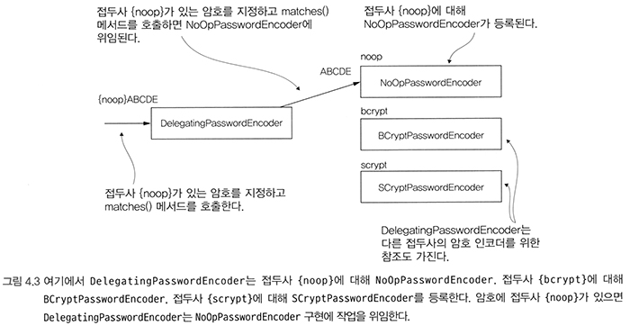
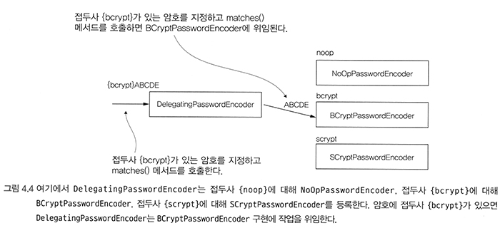
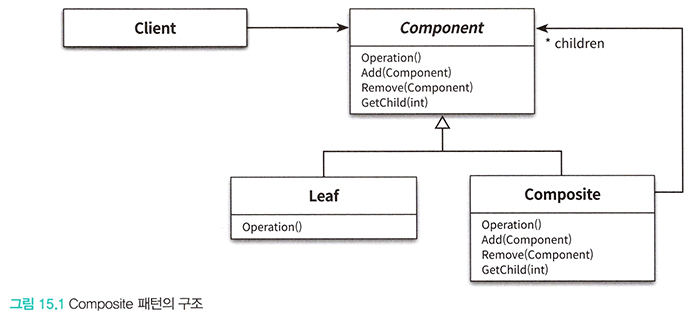

# SSIA
## Chapter 04 - 암호 처리(PasswordEncoder)

---

## 암호화 용어

입력과 출력을 x, y라고 했을 때

<details>
<summary>접기/펼치기 버튼</summary>
<div markdown="1">

### 인코딩(Encoding)
- 주어진 입력에 대한 모든 변환
- 예) x -> y // abc -> cda

### 암호화(Encryption)
- 출력을 얻기 위해, 입력값과 키를 모두 지정해야할 때, 이러한 특수한 인코딩 방법을 '암호화'라고 한다.
- 예) (x, k) -> y

### 복호화 == 역함수 복호화(Reverse Function Decryption)
- 출력과 키값을 이용하여 입력값을 역으로 얻어내는 함수를 이용해, 입력값을 얻어냄
  - 예) (y, k) -> x
- 암호화, 복호화에 사용되는 키가 서로 같을 경우 이 키를 대칭 키라고 한다.

### 비대칭키(Asymmetric Key)
- Encryption, Reverse Function Decryption 에 사용하는 키를 서로 다르게 사용할 때
  - (x, k1) -> y
  - (y, k2) -> x
- 이 때 (k1, k2) 를 키 쌍(key pair)라고 한다.
- 암호화에 사용되는 k1을 공개키(Public Key), k2를 개인키(Private Key)라고 한다.

### 해싱(Hashing)
- 함수가 일방향으로만 작동하는 특수한 인코딩
- 함수의 입력값 x로부터 y를 구할 수 있더라도 출력 y로부터 입력 x를 얻어낼 수 없음
- 하지만 출력 y가 입력 x에 해당하는지 확인할 수 있는 방법이 반드시 있어야한다.
- 결국 해싱 기법은 두가지 함수가 쌍으로 필요하다.
  - x -> y : x에서 y를 얻어내는 함수
  - (x, y) -> boolean : 일치 여부를 얻어내는 함수

### 솔트(Salt)
- 해싱함수의 입력에 임의의 값을 추가하여 암호화
  - 예) (x, k) -> y
  - 여기서 k가 솔트가 된다.
- 솔트를 통해서, 함수를 더 강하게 만들고, 결과에서 입력을 얻는 역함수의 적용 난도를 높일 수 있다.

</div>
</details>

---

## PasswordEncoder 계약

<details>
<summary>접기/펼치기 버튼</summary>
<div markdown="1">

```java
public interface PasswordEncoder {

	String encode(CharSequence rawPassword);
	boolean matches(CharSequence rawPassword, String encodedPassword);
	default boolean upgradeEncoding(String encodedPassword) {
		return false;
	}

}
```
PasswordEncoder 계약을 통해 스프링 시큐리티에 암호를 검증하는 방법을 알려줄 수 있다.
- `encode(...)` : 지정 문자열을 암호화한다. (기능 관점 해시, 암호화)
- `matches(rawPassword, encodedPassword)` : 평문 문자열과 암호화된 패스워드를 비교하여 일치하는 지 여부를 반환한다.
- `upgradeEncoding(...)` : 인코딩 된 암호를 다시 암호화 할 지의 여부
  - 디폴트는 false
  - true를 반환하도록 오버라이드하면 클라이언트 측에서 이를 확인하고, 보안 향상을 위해 기존 암호를 다시 인코딩하도록 할 수 있다.

</div>
</details>

---

## PaswordEncoder 직접 구현
<details>
<summary>접기/펼치기 버튼</summary>
<div markdown="1">

### 가장 단순한 구현
```java
public class PlainTextPasswordEncoder implements PasswordEncoder {

    @Override
    public String encode(CharSequence rawPassword) {
        return rawPassword.toString(); // 암호를 변경하지 않고 그대로 반환
    }

    @Override
    public boolean matches(CharSequence rawPassword, String encodedPassword) {
        return rawPassword.equals(encodedPassword); // 두 문자열이 같은지 확인한다.
    }
}
```
- NoOpPasswordEncoder와 동일한 방식의 구현
- 암호를 단순히 일반 텍스트로 취급한다

### SHA-512로 입력을 해싱하여 암호화하는 PasswordEncoder 구현
```java

public class Sha512PasswordEncoder implements PasswordEncoder {

    @Override
    public String encode(CharSequence rawPassword) {
        return hashWithSHA512(rawPassword.toString());
    }

    private String hashWithSHA512(String input) {
        StringBuilder result = new StringBuilder();
        try {
            MessageDigest messageDigest = MessageDigest.getInstance("SHA-512");
            byte[] digested = messageDigest.digest(input.getBytes());
            for (byte b : digested) {
                result.append(Integer.toHexString(0xFF & b));
            }
            return result.toString(); // 입력의 해시값을 반환함.
        } catch (NoSuchAlgorithmException e) {
            throw new RuntimeException("Bad algorithm", e);
        }
    }

    @Override
    public boolean matches(CharSequence rawPassword, String encodedPassword) {
        String hashedPassword = encode(rawPassword);
        return encodedPassword.equals(hashedPassword);
    }

}
```
- SHA-512 로 원시암호를 해시하여 인코딩하는 방식으로 직접 구현
- 하지만 스프링 시큐리티에서 제공하는 더 좋은 기본 PasswordEncoder 구현체들이 있으므로 차라리 이들을 사용하는 것을 고려해볼만 하다.

</div>
</details>

---

## 여러가지 기본 PasswordEncoder

<details>
<summary>접기/펼치기 버튼</summary>
<div markdown="1">

### StandardPasswordEncoder
```java
PasswordEncoder p = new StandardPasswordEncoder();
PasswordEncoder p = new StandardPasswordEncoder("secret");
```
- `SHA-256` 알고리즘을 사용하여 해싱
- 이제는 사용하지 않는 것이 좋다. (Deprecated)

### Pdkdf2PasswordEncoder
```java
PasswordEncoder p = new Pbkdf2PasswordEncoder();
PasswordEncoder p = new Pbkdf2PasswordEncoder("secret");
PasswordEncoder p = new Pbkdf2PasswordEncoder("secret", 185000, 256);
```
- PBKDF2로 암호를 인코딩
- secret, iterations, hashWidth
  - secret : 키
  - iterations : 암호 인코딩 반복 횟수
  - hashWidth : 해시의 크기
- iterations, hashWidth 값이 클 수록 강력해지지만, 애플리케이션이 소비하는 리소스가 증가한다.

### BCryptPasswordEncoder
```java
PasswordEncoder p = new BCryptPasswordEncoder();
PasswordEncoder p = new BCryptPasswordEncoder(4);

SecureRandom secureRandom = SecureRandom.getInstanceStrong();
PasswordEncoder p = new BCryptPasswordEncoder(4, secureRandom);
```
- bcrypt 강력 해싱함수를 이용한 패스워드 인코더
- strength, SecureRandom
  - strength : 로그 라운드를 나타내는 강도 계수. 해싱 작업이 이용하는 반복 횟수에 영향을 끼친다.
    - 반복 횟수는 2로그 라운드로 계산되고, 이 값은 4~31 사이여야 한다.
  - SecureRandom : 인코딩에 사용되는 SecureRandom

### SCryptPasswordEncoder
```java
PasswordEncoder p = new SCryptPasswordEncoder();
PasswordEncoder p = new SCryptPasswordEncoder(16384, 8, 1, 32, 64);
```
- cpuCost, memoryCost, parallelization, keyLength, saltLength
  - cpuCost : CPU 비용
  - memoryCost : 메모리 비용
  - parallelization : 병렬화 계수
  - keyLength : 키 길이
  - saltLength : 솔트 길이

</div>
</details>

---

## DelegatingPasswordEncoder

<details>
<summary>접기/펼치기 버튼</summary>
<div markdown="1">

### 왜 사용하는가?
- 특정 애플리케이션 버전부터 인코딩 알고리즘을 변경하고 싶을 때
- 현재 사용되던 인코딩 알고리즘의 취약성이 발견되었으나 기존 인코딩 방식을 쉽게 변경할 수 없을 때
- 결국 하나의 애플리케이션에서 여러 방식의 해시를 지원해야 한다.

### 특징




- 내부적으로 여러가지 PasswordEncoder 구현체를 가지고 있고, 이들에게 인코딩을 한뒤 각각의 인코더에 대응하는 접두사를 암호 앞에 붙여서
꾸며줌 (데코레이터)
- 접두사를 기준으로 올바른 PasswordEncoder 구현체에게 작업을 위임
- 만약 기존에 DelegatingPasswordEncoder를 사용하지 않았더라도, 기존의 접두사를 붙이지 않는 PasswordEncoder를 내부적으로
디폴트 패스워드인코더로 설정하여 새로 변경하는 패스워드 인코딩 방식으로 점진적으로 변경시킬 수 있도록 할 수 있음
  - `setDefaultPasswordEncoderForMatches` 메서드를 통해 지정할 수 있다.

### 예시
```java
Map<String, PasswordEncoder> encoders = Map.of(
        "noop", NoOpPasswordEncoder.getInstance(),
        "bcrypt", new BCryptPasswordEncoder(),
        "scrypt", new SCryptPasswordEncoder()
);

passwordEncoder = new DelegatingPasswordEncoder("bcrypt", encoders);
```
- 이와 같이 설정하면 이 DelegatingPasswordEncoder는 내부적으로 3개의 패스워드 인코더를 가진다.
- 기본적인 인코딩 전략은 "bcrypt" 에 대응하는 BCryptPasswordEncoder 이므로 이를 통해 새로 들어오는 암호를 인코딩한다.
- 물론, DB에 bcrypt 말고 다른 인코딩으로 저장된 암호들이 있더라도 이들에 대해서는 해당 방식을 지원하는 패스워드 인코더를
내부적으로 포함하게 해서 match 할 수 있다.
  - upgradeEncoding 메서드가 오버라이드 되어 있으므로, 다른 방식의 인코딩 암호들을 bcrypt 방식으로 갱신하도록 할 수 있다.

```text
{bcrypt}$2a$10$xn3LI/AjqicFYZFruSwve.681477XaVNaUQbrlgioaWPn4tlKsnmG
```
- DB에 저장된 암호가 위와 같을 때, 앞의 접두사 `{bcrpyt}`를 읽고 내부적으로 매핑된 BCryptPasswordEncoder에게 작업을 위임한다.
```text
{noop}12345
```
- DB에 저장된 암호가 위와 같을 때, 앞의 접두사 `{noop}`를 읽고 내부적으로 등록한 NoOpPasswordEncoder에게 작업을 위임한다.


### 스프링 시큐리티에서 제공하는 정적 메서드
```java
	public static PasswordEncoder createDelegatingPasswordEncoder() {
		String encodingId = "bcrypt";
		Map<String, PasswordEncoder> encoders = new HashMap<>();
		encoders.put(encodingId, new BCryptPasswordEncoder());
		encoders.put("ldap", new org.springframework.security.crypto.password.LdapShaPasswordEncoder());
		encoders.put("MD4", new org.springframework.security.crypto.password.Md4PasswordEncoder());
		encoders.put("MD5", new org.springframework.security.crypto.password.MessageDigestPasswordEncoder("MD5"));
		encoders.put("noop", org.springframework.security.crypto.password.NoOpPasswordEncoder.getInstance());
		encoders.put("pbkdf2", new Pbkdf2PasswordEncoder());
		encoders.put("scrypt", new SCryptPasswordEncoder());
		encoders.put("SHA-1", new org.springframework.security.crypto.password.MessageDigestPasswordEncoder("SHA-1"));
		encoders.put("SHA-256",
				new org.springframework.security.crypto.password.MessageDigestPasswordEncoder("SHA-256"));
		encoders.put("sha256", new org.springframework.security.crypto.password.StandardPasswordEncoder());
		encoders.put("argon2", new Argon2PasswordEncoder());
		return new DelegatingPasswordEncoder(encodingId, encoders);
	}
```
- `PasswordEncoderFactories.createDelegatingPasswordEncoder()`를 사용하면
스프링 시큐리티에서 제공하는 DelegatingPasswordEncoder를 사용할 수 있다.

### (참고) 디자인패턴 - Composite 패턴


이 클래스는 Composite 패턴이 적용됐다.

- Client : AuthenticationProvider
- Component : PasswordEncoder
- Leaf : 다른 패스워드 인코더들
- Composite : DelegatingPasswordEncoder

</div>
</details>

---

## DelegatingPasswordEncoder 내부 구현 코드 읽기

DelegatingPasswordEncoder의 내부 구현 방식이 궁금해서 코드를 까서 읽어봤다.
물론 내가 이해한거랑 실제 동작 방식이 약간 다를 수 있음...

<details>
<summary>접기/펼치기 버튼</summary>
<div markdown="1">

### 상태
```java
public class DelegatingPasswordEncoder implements PasswordEncoder {

	private static final String PREFIX = "{";

	private static final String SUFFIX = "}";

	private final String idForEncode;

	private final PasswordEncoder passwordEncoderForEncode;

	private final Map<String, PasswordEncoder> idToPasswordEncoder;

	private PasswordEncoder defaultPasswordEncoderForMatches = new UnmappedIdPasswordEncoder();

}
```
- `PREFIX`, `SUFFIX` : 실제 DB에 저장되는 비밀번호는 `{…}...` 형태로 저장되는데 앞의 `{...}` 을 위하여 갖고 있는 static 상수
- `idForEncode` : 이 인스턴스에서 인코딩에 사용하는 인코더의 id
- `passwordEncoderForEncoder` : 새로 인코딩에 사용하는 PasswordEncoder
- `idToPasswordEncoder` : 등록한 PasswordEncoder들의 Map
  - key : id (접두사 `{...}` 기준 `...` 가 등록됨)
  - value : PasswordEncoder
- `defaultPasswordEncoderForMatches` : 접두사가 없는(DelegatingPasswordEncoder 이전 방식으로 인코딩된) 패스워드들을 매칭할 디폴트 패스워드 인코더
  - 기존의 패스워드 인코딩 방식을 더 이상 사용하지 않고, DelegatingPasswordEncoder를 통해 다른 패스워드 인코딩 방식으로 점진적으로 변경하고 싶을 경우
  이곳에 기존에 쓰던 패스워드 인코더를 두면된다.
  - `setDefaultPasswordEncoderForMatches` 메서드를 사용하여 기존 인코더를 두면 되고 따로 지정하지 않으면 디폴트로 내부 클래스인
  `UnmappedIdPasswordEncoder` 인스턴스가 할당된다.

### 생성자
```java
public DelegatingPasswordEncoder(String idForEncode, Map<String, PasswordEncoder> idToPasswordEncoder) {
    if (idForEncode == null) {
        throw new IllegalArgumentException("idForEncode cannot be null");
    }
    if (!idToPasswordEncoder.containsKey(idForEncode)) {
        throw new IllegalArgumentException(
                "idForEncode " + idForEncode + "is not found in idToPasswordEncoder " + idToPasswordEncoder);
    }
    for (String id : idToPasswordEncoder.keySet()) {
        if (id == null) {
            continue;
        }
        if (id.contains(PREFIX)) {
            throw new IllegalArgumentException("id " + id + " cannot contain " + PREFIX);
        }
        if (id.contains(SUFFIX)) {
            throw new IllegalArgumentException("id " + id + " cannot contain " + SUFFIX);
        }
    }
    this.idForEncode = idForEncode;
    this.passwordEncoderForEncode = idToPasswordEncoder.get(idForEncode);
    this.idToPasswordEncoder = new HashMap<>(idToPasswordEncoder);
}
```
- 유효성 검사
  - idForEncode : 인코딩에 사용할 패스워드 인코더의 id
    - null이여선 안 된다.
  - idToPasswordEncoder : 패스워드 인코더들의 Map
    - `(idForEncode, 인코딩에_사용하는_패스워드_인코더)`가 반드시 내부 요소로 존재해야한다.
    - id가 null인 key가 있어도 된다. (근데 이런 id를 쓰지 않는게 좋을 것이다)
    - id는 `{` 또는 `}`
- 인스턴스 변수 할당

### 인코딩 (encode)
```java
@Override
public String encode(CharSequence rawPassword) {
    return PREFIX + this.idForEncode + SUFFIX + this.passwordEncoderForEncode.encode(rawPassword);
}
```
- 파라미터 : `rawPassword`(평문 패스워드)
- `rawPassword` 앞에 접두사(`{id}`)를 붙이고, 실제 `rawPassword`의 인코딩을 `passwordEncoderForEncode`에게 위임하여 결합한다.
- 실제 인코딩을 내부적으로 가진 인코더에게 위임하고, 앞에 접두사를 붙이는 역할을 수행함. (데코레이터)

### 매칭(match)
```java
@Override
public boolean matches(CharSequence rawPassword, String prefixEncodedPassword) {
    if (rawPassword == null && prefixEncodedPassword == null) {
        return true;
    }
    String id = extractId(prefixEncodedPassword);
    PasswordEncoder delegate = this.idToPasswordEncoder.get(id);
    if (delegate == null) {
        return this.defaultPasswordEncoderForMatches.matches(rawPassword, prefixEncodedPassword);
    }
    String encodedPassword = extractEncodedPassword(prefixEncodedPassword);
    return delegate.matches(rawPassword, encodedPassword);
}
```
- 파라미터 : `rawPassword`(원본 암호), `prefixedEncodedPassword`(저장된 암호 : 접두사가 붙어있다)
- `rawPassword`가 null이고, `prefixedEncodedPassword`가 null이면 true
  - 보통 DB에 비밀번호를 저장할 때 null로 저장하는 것을 허락하진 않을 것이므로 이 조건에 의해 통과되는 일은 없을 듯하다.
- `extractId(prefixedPassword)` 를 통해, id를 추출한다.
  - 앞의 접두사 `{id}` 안에 둘러싸여진 id가 추출된다.
- `id`를 통해서, 대응하는 `passwordEncoder`인 `delegate` 를 찾아낸다.
  - 찾아낸 `delegate`가 null이면? : 맞는 PasswordEncoder가 등록되어 있지 않다는 뜻이다. 이것의 인증처리는 디폴트 패스워드 인코더인
  `defaultPasswordEncoderForMatches` 에게 위임한다. 우리가 기존 방식 인코딩을 사용하다가, `DelegatingPasswordEncoder`로 인코딩 방식을
  변경하였을 경우, 기존 방식의 인코딩 암호의 인증은 디폴트 패스워드 인코더에게 인증 로직을 위임할 수 있는 것이다.
- `delegate`가 존재하면 접두사 뒤의 실제 인코딩 암호를 추출하고(`encodedPassword`), `delegate`에게 위임하여, rawPassword와 매칭한다.

### 패스워드를 다시 인코딩할 것인지 여부(upgradeEncoding)
```java
@Override
public boolean upgradeEncoding(String prefixEncodedPassword) {
    String id = extractId(prefixEncodedPassword);
    if (!this.idForEncode.equalsIgnoreCase(id)) {
        return true;
    }
    else {
        String encodedPassword = extractEncodedPassword(prefixEncodedPassword);
        return this.idToPasswordEncoder.get(id).upgradeEncoding(encodedPassword);
    }
}
```
- 파라미터 : prefixEncodedPassword
- PasswordEncoder 계약의 `upgradeEncoding` : 비밀번호를 다시 인코딩할 지 여부를 묻는 메서드
  - true를 반환하는 것은 비밀번호를 다시 인코딩 요청하길 원한다는 응답이다.
  - false를 반환하는 것은 비밀번호를 다시 인코딩 할 필요가 없다는 응답이다.
- 절차 : `prefixEncodedPassword` 의 접두사로부터 id를 추출하고, 이것이 현재 `idForEncode`(인코딩에 사용하는 인코더의 id)의 id와
  비교했을 때
  - 일치하지 않으면 : 다시 인코딩하길 원한다고 응답한다. (현재 인코더에 맞게 다시 암호를 인코딩해달라고 요청)
  - 일치하면 : 접두사 뒷부분의 encodedPassword를 추출하고, 접두사에 맞는 PasswordEncoder에게 upgradeEncoding 처리를 위임한다.
    (인코더에게 새로 갱신할지 물어본다.)
- 클라이언트는 여기서 반환된 bool 값을 확인하고 인코딩 갱신 요청 여부를 판단할 것이다.

### 디폴트 패스워드 인코더 지정
```java
public void setDefaultPasswordEncoderForMatches(PasswordEncoder defaultPasswordEncoderForMatches) {
    if (defaultPasswordEncoderForMatches == null) {
        throw new IllegalArgumentException("defaultPasswordEncoderForMatches cannot be null");
    }
    this.defaultPasswordEncoderForMatches = defaultPasswordEncoderForMatches;
}
```
- 암호의 접두사가 없을 경우 처리할 디폴트 패스워드 인코더를 지정한다.
- Delegating 방식을 쓰기 이전에 다른 패스워드 인코더를 사용하였을 경우 보통 접두사가 없는 인코딩 패스워드를 사용했을텐데, DelegatingPassword 방식으로 넘어오고 싶을 때 이 방식을 이용하면 된다.


### 내부 구현 메서드
```java
private String extractId(String prefixEncodedPassword) {
    if (prefixEncodedPassword == null) {
        return null;
    }
    int start = prefixEncodedPassword.indexOf(PREFIX);
    if (start != 0) {
        return null;
    }
    int end = prefixEncodedPassword.indexOf(SUFFIX, start);
    if (end < 0) {
        return null;
    }
    return prefixEncodedPassword.substring(start + 1, end);
}

private String extractEncodedPassword(String prefixEncodedPassword) {
    int start = prefixEncodedPassword.indexOf(SUFFIX);
    return prefixEncodedPassword.substring(start + 1);
}
```
- `extractId` : prefixEncodedPassword의 접두사 `{id}` 에서 `id` 을 추출한다.
  - 예) {noop}Aakb7fle3 → noop
- `extractEncodedPassword` : prefixEncodedPassword의 접두사 뒷부분을 추출한다.
  - 예) {noop}Aakb7fle3 → Aakb7fle3

### UnmappedIdPasswordEncoder
```java
private class UnmappedIdPasswordEncoder implements PasswordEncoder {

    @Override
    public String encode(CharSequence rawPassword) {
        throw new UnsupportedOperationException("encode is not supported");
    }

    @Override
    public boolean matches(CharSequence rawPassword, String prefixEncodedPassword) {
        String id = extractId(prefixEncodedPassword);
        throw new IllegalArgumentException("There is no PasswordEncoder mapped for the id \"" + id + "\"");
    }

}
```
- 기본적으로 등록되는 `defaultPasswordEncoderForMatches` 인스턴스의 클래스
- matches 메서드를 다시 읽어보면 암호의 접두사에 해당하는 passwordEncoder가 없을 때 디폴트 패스워드 인코더가 호출된다.
- 그런데 우리가 디폴트 패스워드 인코더를 등록하지 않으면 이 인스턴스가 호출되어 예외가 발생한다.
- DB에 암호가 저장되어 있는데, 이에 대응하는 패스워드 인코더가 어디에도 없으므로(심지어 디폴트 패스워드 인코더도 등록되지 않음) 예외가 발생하는
것이다.


</div>
</details>

---

## KeyGenerator : 키(솔트) 생성

직접 PasswordEncoder를 구현하고 싶을 때, 기반이 되는 키 생성기, 암호기를 스프링 시큐리티가 제공한다.

<details>
<summary>접기/펼치기 버튼</summary>
<div markdown="1">

### StringKeyGenerator
```java
public interface StringKeyGenerator {
	String generateKey();
}
```
```java
StringKeyGenerator keyGenerator = KeyGenerators.string();
String salt = keyGenerator.generateKey();
```
- 이 방식으로 생성된 StringKeyGenerator는 8바이트 키(솔트)를 생성하고, 이를 16진수 문자열로 인코딩한다.

### BytesKeyGenerator
```java
public interface BytesKeyGenerator {

	int getKeyLength();
	byte[] generateKey();

}
```
- 바이트 배열 형태로 키를 반환한다.
- 바이트 배열의 길이도 반환
```java
BytesKeyGenerator keyGenerator = KeyGenerators.secureRandom();

byte[] key = keyGenerator.generateKey();
int keyLength = keyGenerator.getKeyLength();
```
- 이 방식을 사용하면 8바이트 배열의 key를 생성한다.
- 매번 다른 솔트가 생성된다.
```java
BytesKeyGenerator keyGenerator = KeyGenerators.secureRandom(16);
```
- 바이트 길이를 지정할 수 있다.
```java
BytesKeyGenerator keyGenerator = KeyGenerators.shared(16);

byte[] key1 = keyGenerator.generateKey();
byte[] key2 = keyGenerator.generateKey();

log.info("key1 = {}", key1);
log.info("key2 = {}", key2);
assertThat(key1).isEqualTo(key2);
```
- 매번 같은 키(솔트)를 생성하고 싶을 때 이 방식을 사용하면 된다.

</div>
</details>

---
