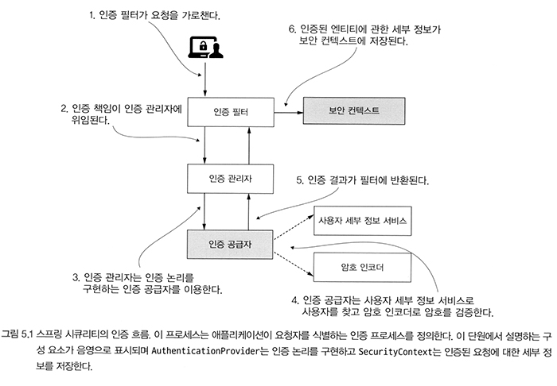
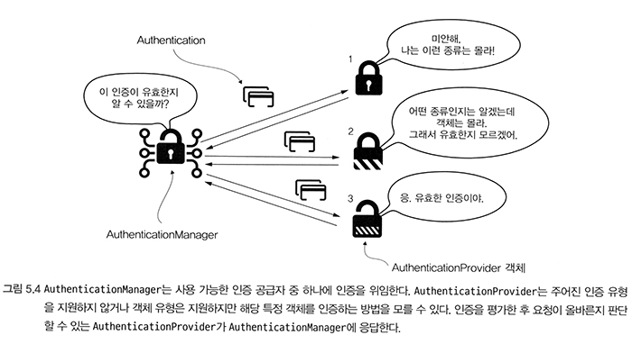

# SSIA
## Chapter 05 - 인증 구현
### ex01 - 인증 요청, 커스텀 인증 로직 구현 및 적용

---

## 인증 흐름



일반적인 스프링 시큐리티 인증 흐름이다.

- AuthenticationFilter는 인증 책임을 AuthenticationManager에게 위임한다.
  - 최종적으로 인증이 성공하면, 인증된 엔티티에 대한 세부 정보가 SecurityContext에 저장된다.
- AuthenticationManager는 여러 AuthenticationProvider들을 알고 있다.
  - 인증 방식은 여러가지가 존재하는데, 각각의 AuthenticationProvider는 자신이 지원할 수 있는 인증인지를 알고 응답할 책임이 있다.
- AuthenticationProvider는 UserDetailsService, PasswordEncoder 를 사용하여 인증 로직을 구현한다.
  - UserDetailsService는 사용자(보안에 필요한 사용자 객체)를 조회한다.
  - PasswordEncoder는 사용자 암호를 해싱하고, 평문 문자열과 비교한다.

---

## Authentication
```java
public interface Authentication extends Principal, Serializable {

	Collection<? extends GrantedAuthority> getAuthorities();
	Object getCredentials();
	Object getDetails();
	Object getPrincipal();
	boolean isAuthenticated();
	void setAuthenticated(boolean isAuthenticated) throws IllegalArgumentException;

}
```
```java
public interface Principal {
    
    // 생략
    
    public String getName();
    
    // 생략
}

```

스프링 시큐리티에서 인증을 나타내는 계약

### 상속 계층 및 메서드
- Principal : java.security.Principal
  - 애플리케이션에 접근을 요청하는 사용자를 '주체'라고 한다.
  - `getName()` : 사용자의 이름 반환
- Authentication
  - `getCredentials()` : 사용자의 암호, 코드, 지문, 등 여러가지 비밀
  - `getAuthorities()` : 사용자의 권한들을 컬렉션으로 반환
  - `getDetails()` : 추가 세부 정보
  - `isAuthenticated()` : 인증 객체가 인증 됐거나(true), 인증 프로세스가 진행 중인지(false) 반환

---

## AuthenticationProvider 계약


```java
public interface AuthenticationProvider {
	Authentication authenticate(Authentication authentication) throws AuthenticationException;
	boolean supports(Class<?> authentication);
}
```
- `authenticate(authentication)` : 인증 로직을 정의한다.
  - 인증이 실패하면 AuthenticationException을 throw 해야한다.
  - 현재 AuthenticationProvider 구현에서 지원하지 않는 인증 객체를 받으면 null을 반환해야 한다.
  - 인증이 성공하면 인증된 객체를 나타내는 Authentication 인스턴스를 반환해야 한다.
    - 이 Authentication 인스턴스에 대해, `isAuthenticated()`는 true를 반환해야한다.
    - 이 Authentication 인스턴스는, 인증된 엔티티의 필수 세부 정보가 포함된다.
    - 일반적으로 이 인스턴스에서 암호와 같은 민감한 데이터는 제거해야 한다.
- `supports(...)` : 파라미터로 전달된 Authentication 형식을 지원하면 true를 반환한다.
  - 다만 여기서 true를 반환하더라도 AuthenticationProvider가 null을 반환해서 요청을 거부할 수 있다. 이 경우는,
  해당 Authentication이 무엇인지는 알지만 해당 AuthenticationProvider가 처리할 수 없는 종류가 아니라고 응답하는 것에 해당한다.

---

## CustomAuthenticationProvider
```java
@Component
@RequiredArgsConstructor
public class CustomAuthenticationProvider implements AuthenticationProvider {

    private final UserDetailsService userDetailsService;
    private final PasswordEncoder passwordEncoder;

    @Override
    public Authentication authenticate(Authentication authentication) throws AuthenticationException {
        String username = authentication.getName();
        String password = authentication.getCredentials().toString();

        UserDetails u = userDetailsService.loadUserByUsername(username);

        if (passwordEncoder.matches(password, u.getPassword())) {
            return new UsernamePasswordAuthenticationToken(
                    username,
                    password,
                    u.getAuthorities()
            );
        } else {
            throw new BadCredentialsException("Something went wrong!");
        }
    }

    @Override
    public boolean supports(Class<?> authenticationType) {
        return authenticationType.equals(UsernamePasswordAuthenticationToken.class);
    }
}
```
- `supports(...)` 구현 : 이 AuthenticationProvider가 `UsernamePasswordAuthenticationToken`를 지원하도록 함
- `authenticate(...)` 구현
  - 요청에서 가져온 authentication에서 username, password를 가져온다. 
  - UserDetailsService로부터, 동일한 username의 UserDetails를 가져온다.
    - 가져오는데 실패하면 UsernameNotFoundException이 발생한다. (AuthenticationException의 인스턴스이다.)
  - PasswordEncoder를 통해 패스워드를 매칭한다.
    - 일치하지 않으면 AuthenticationException의 인스턴스인 BadCredentialsException을 발생시킨다.
    - 일치하면 UsernamePasswordAuthenticationToken 인스턴스를 생성하여 반환한다.

---
